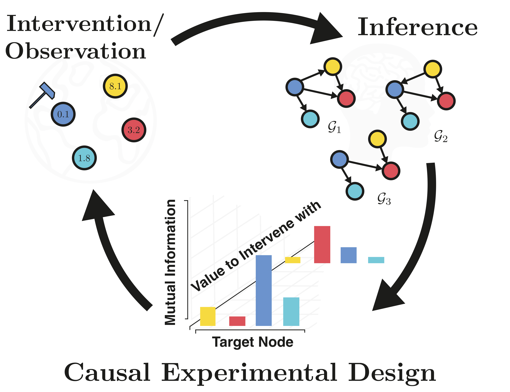

[]([http://google.com.au/](https://arxiv.org/abs/2203.02016)) 


# Causal Bayesian Experimental Design (CBED)

## Overview 

This is the official repository with the python implementation for the paper "[Interventions, Where and How? Experimental Design for Causal Models at Scale](https://arxiv.org/abs/2203.02016)", NeurIPS (2022). 

The repository contains different acquisition strategies for optimal targeted interventions to learn causal models, including the proposed approach _CBED_ (which acquires both intervention target and value). The provided repository further contains two different batching strategies: the greedy strategy and the stochastic batch strategy.

<p align="center">

</p>

## Installation

In order to run this repository on your machine, it is recommended to follow the below steps.

1. Clone the repository
```bash
git clone --recurse-submodules https://github.com/yannadani/cbed.git
cd cbed
```
2. Install the relevant packages in an environment, either through pip or Anaconda. Anaconda is preferable as R packages can be installed easily without much effort. To do so, please do the following:
```bash
conda env create -f environment.yml
conda activate cbed_env
```

It is also possible to run the proposed CBED with just a venv. However, you will not be able compute the Structural Interventional Distance (SID) which requires R. In addition, R is also required by DAG bootstrap. If you are not planninng to use R (or have R already installed), run the following:

```bash
python3 -m venv cbed_env
source cbed_env/bin/activate
```

3. Install the requirements by running the following commands:
```bash
pip install -r requirements.txt
pip install --upgrade "jax[cuda]" -f https://storage.googleapis.com/jax-releases/jax_cuda_releases.html
pip install -e models/dibs
```

If using R, then run:
```bash
Rscript models/dag_bootstrap_lib/install.r
```

## Usage

The posterior models to estimate the expected information gain are located inside `models`. These include [DiBS](https://arxiv.org/abs/2105.11839) and [DAG Bootstrap with GIES](https://arxiv.org/abs/1902.10347). In the paper, we use DAG bootstrap for the linear models and DiBS for nonlinear models. 

- In order to run the CBED acquisition strategy for nonlinear SCM for 50 nodes, run the following command:
```bash
python experimental_design.py --nonlinear --model dibs_nonlinear --num_nodes 50 --strategy softcbed --value_strategy gp-ucb 
```
- If `R` is not installed, run the following command:
```bash
python experimental_design.py --nonlinear --model dibs_nonlinear --num_nodes 50 --strategy softcbed --value_strategy gp-ucb --no_sid
```

- For running on the DREAM environment, run the following command:
```bash
python experimental_design.py --num_nodes 50 --model dibs_nonlinear --noise_type gaussian --strategy softcbed --env dream4 --dream4_path envs/dream4/configurations --dream4_name InSilicoSize50-Yeast1
```
## Reproducing the results 
- To reproduce the results in the paper, run the following command for nonlinear SCM:
```bash
bash run_experiments.sh --nonlinear --model dibs_nonlinear --strategy <strategy> --value_strategy <value_strategy> --num_nodes <num_nodes>
```
where `strategy` is one of `cbed`, `greedycbed`, `softcbed`, `random`, `ait` and `value_strategy` is one of `gp-ucb`, `fixed`, `sample-dist`. Num nodes is any number of nodes of your choice. In the paper, we run it for `50` and `20` nodes.

- For running linear SCMs, run the following command:
```bash
bash run_experiments.sh --model dag_bootstrap --strategy <strategy> --value_strategy <value_strategy> --num_nodes <num_nodes>
```
with the arguments the same as before.

**Note**: If you are running experiments of different strategies with same data seeds on different machines, [JAX can show non-deterministic behaviour](https://github.com/google/jax/issues/4823) which might mean the initial model after having trained on observational data could be differernt. In order to counteract this, set the environment variable `XLA_FLAGS='--xla_gpu_deterministic_reductions --xla_gpu_autotune_level=0'`.

- Finally, to reproduce the entire set of experiments on DREAM, run the following command and follow the ensuing commands shown on the screen:
```bash
wandb sweep dream_sweep.yml
```

## Reference
This code is official implementation of the following paper:
> Panagiotis Tigas, Yashas Annadani, Andrew Jesson, Bernhard Schölkopf, Yarin Gal and Stefan Bauer. **Interventions, Where and How? Experimental Design for Causal Models at Scale**. In Advances of Neural Information Processing Systems (NeurIPS), 2022. [PDF](https://arxiv.org/pdf/2203.02016.pdf)

If this code was useful, please consider citing this work.
```
@article{tigas2022interventions,
  title={Interventions, where and how? experimental design for causal models at scale},
  author={Tigas, Panagiotis and Annadani, Yashas and Jesson, Andrew and Sch{\"o}lkopf, Bernhard and Gal, Yarin and Bauer, Stefan},
  journal={Advances in Neural Information Processing Systems},
  year={2022}
}
```
